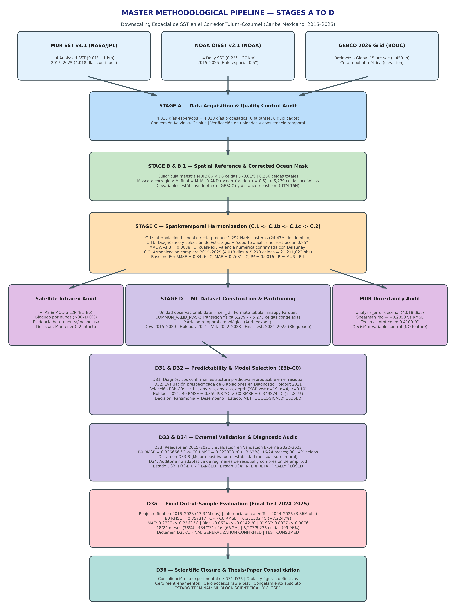
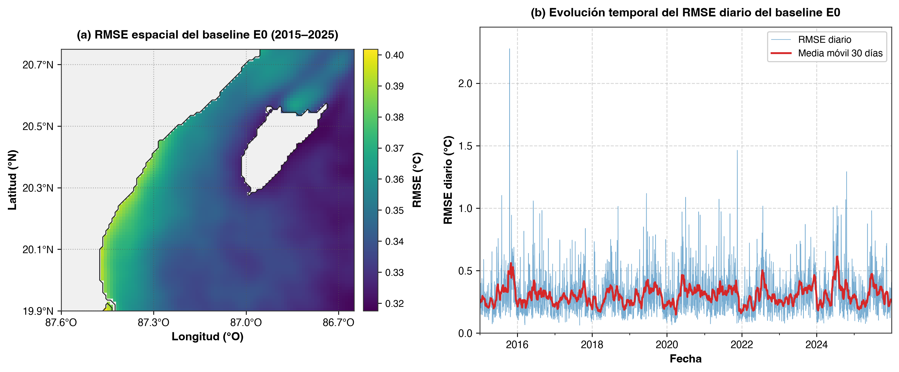

# Residual Machine Learning for Coastal SST Downscaling in the Mexican Caribbean
### Master's Thesis Project — Tulum–Cozumel, Quintana Roo, Mexico

[](https://www.python.org/)
[-brightgreen.svg)]()
[]()
[]()
[]()

---

## 1. Project Overview

This repository contains the complete, reproducible computational framework developed for the Master's Thesis on Sea Surface Temperature (SST) statistical downscaling in the **Tulum–Cozumel marine corridor** (Mexican Caribbean). The scientific objective is to downscale daily coarse-resolution SST from **NOAA OISST v2.1** (~0.25°, ~27 km) to a fine-resolution grid (~0.01°, ~1 km) compatible with **MUR SST v4.1** by coupling physical spatial predictors (GEBCO 2026 bathymetry), astronomical periodicity (day of year harmonics), and supervised decision-tree algorithms.

The operational architecture adopts a **residual-learning formulation**:
1. **Bilinear Baseline ($B_0$):** Coarse OISST is projected onto the fine grid via bilinear interpolation with coastal extension support (Strategy A): $\text{SST}_{\text{BIL}}$.
2. **Residual Target ($R$):** The model predicts the fine-scale thermal discrepancy relative to the high-resolution reference:
   $$R = \text{SST}_{\text{MUR}} - \text{SST}_{\text{BIL}}$$
3. **Reconstructed Field ($C_0$):** High-resolution SST is reconstructed by adding the predicted residual correction:
   $$\hat{\text{SST}} = \text{SST}_{\text{BIL}} + \hat{R}$$

Algebraically, if $\hat{R} = 0$, then $\hat{\text{SST}} \equiv \text{SST}_{\text{BIL}}$, ensuring that a zero-residual prediction exactly preserves the bilinear baseline. The confirmed operational model is **`E3b-C0`** (compact XGBoost regressor).

> [!NOTE]
> **Operational Role of MUR SST:** In this study, MUR SST v4.1 serves as the **high-resolution operational reference**, not as absolute ground truth. In-situ buoy networks are scarce in this reef corridor, and satellite infrared measurements are frequently occluded by tropical cloud cover.



---

## 2. Study Area

The domain covers the coastal and reef ecosystem of the **Tulum–Cozumel sector** in Quintana Roo, Mexico (western Caribbean):
- **Latitude:** $19.90^\circ\text{N}$ to $20.75^\circ\text{N}$
- **Longitude:** $-87.60^\circ\text{W}$ to $-86.65^\circ\text{W}$
- **Grid Dimensions:** 86 latitude rows $\times$ 96 longitude columns = 8,256 total grid cells at 0.01° (~1 km) resolution.
- **Ocean / Land Mask:** 5279 harmonized ocean cells (5,279 marine cells) (63.94% of the domain) and 2,977 land cells (36.06%), derived from GEBCO ocean fraction $\ge 0.5$.
- **Geographic Scope:** The domain includes the Mesoamerican Barrier Reef reef lagoons, the Cozumel Island shelf, the Cozumel Channel, and deep oceanic basins (>1000 m). *The Yucatán Channel proper is located north of 21.5°N and is not within the study domain.*



---

## 3. Data Sources

The full study period spans **2015-01-01 to 2025-12-31** (**4018 days** / 4,018 continuous astronomical days, 100.0% temporal completeness, 0 missing dates, 0 duplicates):

| Dataset | Provider / Sensor | Spatial Resolution | Temporal Cadence | Role in Pipeline |
| :--- | :--- | :---: | :---: | :--- |
| **MUR SST v4.1** | NASA JPL (Multi-sensor L4) | 0.01° (~1 km) | Daily | High-resolution SST reference & target residual |
| **NOAA OISST v2.1** | NOAA NCEI daily optimally interpolated L4 SST | 0.25° (~27 km) | Daily | Coarse-scale SST predictor & bilinear baseline |
| **GEBCO 2026** | IHO / IOC GEBCO Consortium (GEBCO 2026 Grid) | 15 arc-seconds (~450 m) | Static | Bathymetric depth, coast distance & land/ocean mask |
| **VIIRS S-NPP L2P** | NASA / NOAA (Orbital Radiometer) | 750 m nominal | Swaths | Independent radiometric validation audit |
| **MODIS Aqua L2P** | NASA OB.DAAC (Thermal IR) | 1 km nominal | Swaths | Independent radiometric validation audit |

---

## 4. Methodological Pipeline Summary

The project was executed across four chronological, methodologically sealed stages:

### Stage A — Data Acquisition and Audit
- Complete temporal ingestion and audit of MUR SST and NOAA OISST for all 4,018 study dates.
- Extraction of regional GEBCO 2026 Grid sub-dataset.
- Multi-sensor orbital satellite audit (VIIRS L2P v2.80 and MODIS Aqua L2P v2019.0).
- **Status:** **COMPLETED**

### Stage B — Spatial Framework and Mask Harmonization
- Construction of master regular grid (86 $\times$ 96 cells at 0.01°).
- Mask correction based on physical GEBCO shoreline ($\text{ocean\_fraction} \ge 0.5$).
- Calculation of static physiographic covariates: bathymetric depth ($depth$) and euclidean distance to coast ($distance\_coast\_km$).
- Official marine census: **5,279 harmonized ocean cells**.
- **Status:** **COMPLETED**

### Stage C — Spatiotemporal Harmonization (2015–2025)
- **Coastal boundary problem:** Direct bilinear interpolation from coarse 0.25° OISST produced 1,292 coastal NaNs (24.47% domain loss) due to continental grid nodes on the Yucatán Peninsula.
- **Coastal Strategy A:** Auxiliary nearest-ocean extrapolation onto 20 continental halo nodes, enabling 100% complete bilinear interpolation across all 5,279 ocean cells without coastal data loss.
- Construction of the decadal data cube `faseC2_2015_2025.nc` (540.82 MB, **21,211,022 spacetime observations**).
- Independent radiometric audit across extreme discrepancy events (E1–E6).
- Decadal characterization of MUR uncertainty (`analysis_error`).
- **Status:** **COMPLETED**

### Stage D — Machine Learning Modeling & Confirmatory Evaluation
- **D.1:** Analytical tabular dataset construction with strict anti-leakage chronological partitions.
- **D31:** Predictability diagnostics supporting reproducible predictive structure in the residual beyond persistence and local climatology baselines.
- **D32:** Model selection and feature ablation on Development Holdout (2021). Selection of parsimonious `E3b-C0` over 5 expanded spatio-temporal variants (6 candidate configurations evaluated in total).
- **D33:** External out-of-sample temporal validation on 2022–2023. Positive global and spatial generalization, but insufficient month-level stability to satisfy the predeclared D33-A criterion. Formal status: **D33-B — UNCHANGED** (16 / 24 months improved).
- **D34:** Post-validation spatial, regime, and calibration micro-audits.
- **D35:** Terminal confirmatory evaluation on previously withheld Final Test (2024–2025). All seven predeclared D35-A criteria were satisfied under formal ruling **D35-A — FINAL GENERALIZATION CONFIRMED**.
- **D36:** Paper-ready figure and table consolidation.
- **Status:** **SCIENTIFICALLY CLOSED**

---

## 5. Grid Census: 5,279 vs 5,275 Marine Cells

A key methodological distinction documented in [ML_FINAL_SYNTHESIS.md](DATASET_TESIS/ml_results/E3b_FINAL_SYNTHESIS/reports/ML_FINAL_SYNTHESIS.md):
- **Stage B & C Harmonized Cube:** Contains **5,279 ocean cells** (physical ocean census).
- **Stage D Machine-Learning Domain:** Evaluates **5275 frozen ML cells** (5,275 frozen cells, `frozen_cell_ids.csv`).

The harmonized SST cube contains 5,279 ocean cells. The machine-learning evaluation domain contains 5,275 frozen cells. Four cells were excluded when establishing the common evaluation mask required for the D32 spatial ablations because the corresponding engineered gradient feature was undefined due to lack of adjacent marine neighbors for centered/one-sided finite differences.

---

## 6. Temporal Evaluation Design

To prevent temporal leakage caused by strong serial autocorrelation in oceanic temperatures, data were split chronologically without random shuffling:

| Period | Dates | Days | ML Rows (Nominal) | Role in Framework | Status |
| :--- | :--- | :---: | :---: | :--- | :--- |
| **Development** | 2015-01-01 to 2020-12-31 | 2,192 | 11,562,800* | Model training & hyperparameter tuning | Archived |
| **Holdout** | 2021-01-01 to 2021-12-31 | 365 | 1,925,375 | Diagnostic model comparison & ablation (D32) | Archived |
| **Validation** | 2022-01-01 to 2023-12-31 | 730 | 3,850,750 | Out-of-sample external validation (D33) | Archived |
| **Final Test** | 2024-01-01 to 2025-12-31 | 731 | 3,856,025 | Confirmatory terminal generalization (D35) | **CONSUMED** |

*\*Note on Development Row Count:* Nominal period counts are shown ($2,192 \times 5,275 = 11,562,800$). The D32 common ablation comparison used 11,546,975 development rows after applying the common temporal-validity mask required by the three-day lag configuration (`E3b-T3`). In subsequent refits, the full available temporal window was used: 2015–2021 for D33 validation refit, and 2015–2023 (17,338,925 observations) for D35 final refit.

> [!CAUTION]
> **FINAL TEST = CONSUMED.**
> **FINAL TEST 2024–2025 IS PERMANENTLY CONSUMED.**
> The 2024–2025 period was held completely blind until the single inference pass in Stage D.3.5. Model development is permanently closed. D35 scripts may only be rerun as a technical post-consumption reproducibility run, never as a new confirmatory test.

---

## 7. Confirmed Model Specification: E3b-C0

`E3b-C0` was selected over five more complex temporal-lag and spatial-neighborhood configurations (`E3b-T1`, `E3b-T3`, `E3b-S`, `E3b-TS`, `E3b-ALL`) based on out-of-sample skill and strict parsimony principles (6 candidate configurations evaluated):

- **Algorithm:** Gradient Boosted Trees via `xgboost.XGBRegressor` (`tree_method='hist'`)
- **Input Features ($k = 4$):**
  1. `sst_bil`: Bilinearly interpolated coarse OISST (°C)
  2. `doy_sin`: Sine harmonic of astronomical day of year ($\sin(2\pi \cdot \text{DOY} / 365.25)$)
  3. `doy_cos`: Cosine harmonic of astronomical day of year ($\cos(2\pi \cdot \text{DOY} / 365.25)$)
  4. `depth`: GEBCO 2026 bathymetric depth, expressed as positive meters below sea level (depth = positive meters below sea level ($\text{depth} = -\text{elevation}$ for ocean cells)
- **Frozen Hyperparameters ($\theta^*$):**
  `n_estimators=19`, `max_depth=4`, `learning_rate=0.10`, `subsample=0.8`, `colsample_bytree=0.8`, `min_child_weight=5`, `objective='reg:squarederror'`, `random_state=42`.

---

## 8. Key Results

All numerical values are verified against canonical tables and frozen manifests:

### A. Stage Progression Summary

| Evaluation Stage | Period | Baseline ($B_0$) RMSE | Model ($C_0$) RMSE | Relative Skill ($\Delta\text{RMSE}\%$) | Temporal Robustness | Ruling |
| :--- | :---: | :---: | :---: | :---: | :---: | :---: |
| **Diagnostic Holdout (D32)** | 2021 | 0.359493 °C | 0.349274 °C | **+2.8424%** | — | Parsimony Winner (6 D32 configurations) |
| **External Validation (D33)** | 2022–2023 | 0.335666 °C | 0.323838 °C | **+3.5237%** | 16 / 24 months (66.7%) | **D33-B — UNCHANGED** |
| **Final Test (D35)** | 2024–2025 | 0.357317 °C | 0.331502 °C | **+7.2247%** | 18 / 24 months (75.0%) | **D35-A — CONFIRMED** |

### B. Final Test 2024–2025 Detailed Metrics (Stage D35)
- **Sample Size:** 3,856,025 out-of-sample observations (731 days $\times$ 5,275 cells).
- **Error Reduction:** $\Delta\text{RMSE} = -0.025815^\circ\text{C}$ (+7.2247% relative improvement).
- **Mean Absolute Error (MAE):** Reduced from $0.272713^\circ\text{C}$ to $0.256325^\circ\text{C}$ (+6.01%).
- **Mean Bias:** Reduced from $-0.062425^\circ\text{C}$ to $-0.014197^\circ\text{C}$ (77.3% bias reduction).
- **Reconstructed SST $R^2$:** Increased from $0.892661$ ($B_0$) to **$0.907610$** ($C_0$).
- **Annual Breakdown:**
  - **Year 2024:** $B_0 = 0.3797^\circ\text{C} \to C_0 = 0.3440^\circ\text{C}$ (**+9.3986%** skill).
  - **Year 2025:** $B_0 = 0.3334^\circ\text{C} \to C_0 = 0.3185^\circ\text{C}$ (**+4.4704%** skill).
- **Monthly Improvement Allocation (GAP-10 Canonical Truth):**
  - Exactly **18/24 months** improved (18 of 24 months ($\Delta\text{RMSE} < 0$, **75.0%** consistency).
  - **9/12 in 2024** improved (unimproved: 2024-01, 2024-04, 2024-10).
  - **9/12 in 2025** improved (unimproved: 2025-09, 2025-10, 2025-12).
- **Daily Robustness:** **484/731 days** improved (66.21%).
- **Spatial Coverage:** **5273/5275 cells** improved (5,273 of 5,275 ocean cells, **99.96%** spatial coverage).
- **Block Bootstrap Invariance:** 14-day moving-block bootstrap (1,000 resamples):
  $$CI_{95}(\Delta\text{RMSE}) = [-0.042485, -0.009792]^\circ\text{C}$$
  The 95% bootstrap interval remained entirely below zero, supporting the robustness of the aggregate RMSE improvement under short-range temporal dependence at the evaluated block length.

### C. Residual-Regime Dependence
Evaluated using pre-test frozen DEV percentiles of absolute residual discrepancy $|R|$ (anchored at DEV-P50 = 0.2066 up to DEV-P99 = 0.9659):

| Regime | Cutoff ($|R|$) | % Test Data | Baseline RMSE | Model RMSE | Skill ($\Delta\text{RMSE}\%$) | Sign Accuracy |
| :--- | :---: | :---: | :---: | :---: | :---: | :---: |
| **DEV-P0–P50** | $< 0.2066^\circ\text{C}$ | 48.16% | 0.1154 °C | 0.1396 °C | **-20.99%** | 56.4% |
| **DEV-P50–P75** | $0.2066\text{–}0.3604^\circ\text{C}$ | 24.35% | 0.2808 °C | 0.2710 °C | **+3.51%** | 65.8% |
| **DEV-P75–P90** | $0.3604\text{–}0.5377^\circ\text{C}$ | 15.68% | 0.4400 °C | 0.4071 °C | **+7.48%** | 70.9% |
| **DEV-P90–P95** | $0.5377\text{–}0.6652^\circ\text{C}$ | 5.29% | 0.5961 °C | 0.5412 °C | **+9.21%** | 75.7% |
| **DEV-P95–P99** | $0.6652\text{–}0.9659^\circ\text{C}$ | 4.71% | 0.7877 °C | 0.6926 °C | **+12.07%** | 82.5% |
| **DEV-P99+** | $\ge 0.9659^\circ\text{C}$ | 1.80% | 1.1469 °C | 1.0151 °C | **+11.49%** | 87.2% |

- In the **small MUR–BIL discrepancy regime** ($|R| < 0.2066^\circ\text{C}$), there was **a 20.99% relative degradation**. Baseline absolute errors in this regime were already small, leaving less margin for beneficial correction and lower residual-sign agreement was associated with relative degradation.
- In **larger MUR–BIL discrepancy regimes** ($|R| \ge 0.2066^\circ\text{C}$), sign agreement increased and RMSE improvement ranged from approximately **+3.51% to +12.07%**.

---

## 9. Important Interpretation Boundaries

To maintain strict scientific integrity during thesis drafting and review:

| What the Study DOES Demonstrate | What the Study DOES NOT Claim |
| :--- | :--- |
| Reproducible reduction in SST reconstruction error relative to bilinear baseline (+7.22% global RMSE skill). | Reconstruction of submesoscale ocean dynamics or turbulence. |
| Confirmed temporal generalization across an independent, previously withheld 2-year period (2024–2025). | Causal attribution of skill to specific oceanographic mechanisms (e.g. upwelling, fronts, currents). |
| Spatially widespread improvement (99.96% of ocean cells improved). Larger improvements were observed in shallow cells, and improvement magnitude also decreased with increasing offshore distance. | Direct identification or enhanced detection of Marine Heatwaves (MHW) without specialized extreme metrics. |
| Regime-dependent correction behavior (amplitude compression consistent with regularized MSE loss: $\text{std}(\hat{R})/\text{std}(R) \approx 0.25$). | MUR SST acting as absolute ground truth (MUR is an L4 satellite product with its own interpolation uncertainties). |

---

## 10. Note on C.2 Baseline E0 Metrics (GAP-12 Clarification)

When reviewing historical Phase C.2 reports:
- **Pooled Spatiotemporal RMSE decenal:** **$0.342596^\circ\text{C} \approx 0.3426^\circ\text{C}$**  
  $$\text{RMSE}_{\text{pooled}} = \sqrt{\frac{1}{N} \sum_{t=1}^{4018} \sum_{c=1}^{5279} (T_{\text{BIL}} - T_{\text{MUR}})^2}$$
  Annual pooled RMSE ranges from **$0.3034^\circ\text{C}$ (2018)** to **$0.3811^\circ\text{C}$ (2015)**, with 2024 at **$0.3797^\circ\text{C}$**.
- **Mean Daily Spatial RMSE decenal:** **$0.301914^\circ\text{C} \approx 0.3019^\circ\text{C}$**  
  $$\overline{\text{RMSE}}_{\text{daily}} = \frac{1}{4018} \sum_{d=1}^{4018} \text{RMSE}_d$$
  Annual mean daily RMSE ranges from **$0.2724^\circ\text{C}$ (2018)** to **$0.3257^\circ\text{C}$ (2024)**.

By Jensen's inequality, $\text{mean}(\text{RMSE}_d) \le \sqrt{\text{mean}(\text{RMSE}_d^2)}$ ($0.3019^\circ\text{C} \le 0.3426^\circ\text{C}$). These are distinct aggregation statistics and should not be compared as if they were identical metrics (see [fase_c2_reporte.md](DATASET_TESIS/reports/fase_c2_reporte.md) and [ML_FINAL_SYNTHESIS.md](DATASET_TESIS/ml_results/E3b_FINAL_SYNTHESIS/reports/ML_FINAL_SYNTHESIS.md)).

---

## 11. Consolidated Deliverables & Canonical Documentation

The directory [`DATASET_TESIS/ml_results/E3b_FINAL_SYNTHESIS/`](DATASET_TESIS/ml_results/E3b_FINAL_SYNTHESIS/) serves as the primary consolidated repository for all paper-ready and thesis-ready figures, tables, and narrative reports. Supporting stage-specific reports are preserved in `DATASET_TESIS/reports/` and respective `ml_results/` subdirectories:

| Master Document / Asset | Relative Path | Scope and Purpose | Canonical Status |
| :--- | :--- | :--- | :---: |
| **Master ML Synthesis** | [`ML_FINAL_SYNTHESIS.md`](DATASET_TESIS/ml_results/E3b_FINAL_SYNTHESIS/reports/ML_FINAL_SYNTHESIS.md) | Comprehensive narrative synthesis of Machine Learning Stages D31–D36 | **CONSOLIDATED & FROZEN** |
| **Methods Manuscript** | [`paper_methods_ML.md`](DATASET_TESIS/ml_results/E3b_FINAL_SYNTHESIS/reports/paper_methods_ML.md) | Formulations, equations, features, split dates, protocols for publication | **AUDITED & FROZEN** |
| **Results Manuscript** | [`paper_results_ML.md`](DATASET_TESIS/ml_results/E3b_FINAL_SYNTHESIS/reports/paper_results_ML.md) | Quantitative tables, metric comparisons, moving-block bootstrap | **AUDITED & FROZEN** |
| **Discussion & Claims** | [`paper_discussion_ML.md`](DATASET_TESIS/ml_results/E3b_FINAL_SYNTHESIS/reports/paper_discussion_ML.md) | Interpretation boundaries, mechanism discussion & claims classification | **AUDITED & FROZEN** |
| **Figure Selection Guide** | [`FIGURE_SELECTION_GUIDE.md`](DATASET_TESIS/ml_results/E3b_FINAL_SYNTHESIS/FIGURE_SELECTION_GUIDE.md) | Placement and structure of Figures 1–5 for ICITS'27 & Master's Thesis | **CANONICAL** |
| **Publication Figures** | [`figures/`](DATASET_TESIS/ml_results/E3b_FINAL_SYNTHESIS/figures/) | High-resolution publication-ready figures (PNG & PDF) | **PAPER-READY** |
| **Canonical Summary Tables** | [`tables/`](DATASET_TESIS/ml_results/E3b_FINAL_SYNTHESIS/tables/) | Paper-ready summary CSV tables (Performance, Robustness, Regimes) | **VERIFIED** |
| **Decadal NetCDF Report** | [`fase_c2_reporte.md`](DATASET_TESIS/reports/fase_c2_reporte.md) | Technical audit of the 2015–2025 harmonized data cube (Stage C.2) | **COMPLETED** |
| **Satellite Validation Report**| [`validacion_infrarroja_integrada_FINAL.md`](DATASET_TESIS/reports/validacion_infrarroja_integrada_FINAL.md) | Multi-sensor satellite validation audit (VIIRS & MODIS L2P) | **COMPLETED** |

---

## 12. Repository Structure

```text
Downscaling-corredor-Tulum-Cozumel/
├── README.md                                <- Main repository entry point and executive synthesis
├── requirements.txt                         <- Exact Python package dependencies
├── pyrefly.toml                             <- Environment and runtime configuration
├── auditar_datos_tesis.py                   <- Global data auditing script
├── _archive_readme/                         <- Historical README backups
│   ├── README_pre_final_update.md
│   └── README_root_pre_final_sync.md
│
├── DATASET_TESIS/                           <- Main analytical and experimental workspace
│   ├── README.md                            <- Detailed technical pipeline documentation
│   ├── config.py                            <- Centralized spatial, temporal and grid configuration
│   ├── requirements.txt                     <- Pipeline-specific dependencies
│   ├── _archive_readme/                     <- Technical README backups
│   │
│   ├── outputs/                             <- Harmonized NetCDF data cubes
│   │   ├── faseC2_2015_2025.nc              <- Harmonized decadal NetCDF cube (540.8 MB, 4018 days)
│   │   └── fase_c2/                         <- Yearly harmonized NetCDF files (2015–2025)
│   │
│   ├── ml_dataset/                          <- Analytical ML Parquet splits (5,275 frozen cells)
│   │   ├── METADATA.md                      <- Dataset construction metadata & provenance
│   │   ├── train/                           <- train_2015.parquet to train_2021.parquet
│   │   ├── validation/                      <- validation_2022.parquet, validation_2023.parquet
│   │   └── test/                            <- test_2024.parquet, test_2025.parquet (CONSUMED)
│   │
│   ├── ml_results/                          <- Machine learning experimental phases and outputs
│   │   ├── diagnostics_D31/                 <- Stage D31 predictability diagnostics
│   │   ├── E3b_D32/                         <- Stage D32 model selection & feature ablation
│   │   ├── E3b_D33_external_validation/     <- Stage D33 validation (2022–2023, D33-B)
│   │   ├── E3b_D34_postvalidation_diagnostics/ <- Stage D34 sub-regime & micro-audits
│   │   ├── E3b_D35_final_test/              <- Stage D35 terminal confirmatory test (2024–2025, D35-A)
│   │   │   ├── final_test_freeze_manifest.json
│   │   │   ├── final_test_execution_log.json
│   │   │   ├── frozen_spatial_metadata.csv
│   │   │   ├── reports/                     <- Confirmatory test evaluation reports
│   │   │   └── tables/                      <- Detailed final test metric tables
│   │   ├── E3b_FINAL_SYNTHESIS/             <- Consolidated paper-ready deliverables
│   │   │   ├── FIGURE_SELECTION_GUIDE.md    <- Comprehensive figure placement guide
│   │   │   ├── figures/                     <- Publication-ready figures (PNG & PDF)
│   │   │   ├── reports/                     <- Final ML synthesis, methods, results & discussion
│   │   │   └── tables/                      <- Paper-ready canonical summary tables
│   │   ├── random_forest_E2/                <- Phase D2 Random Forest baseline experiments
│   │   └── xgboost_E3/                      <- Phase D3 preliminary XGBoost experiments
│   │
│   ├── figures/                             <- Pipeline, baseline E0, and diagnostic figures
│   │   └── figura_baseline_rmse_espacio_temporal_2015_2025.png
│   ├── reports/                             <- Satellite validation, NetCDF C2 & data quality audits
│   ├── modules/                             <- Core modular Python library
│   │   ├── bathymetry.py                    <- GEBCO bathymetric interpolation
│   │   ├── coast_distance.py                <- Geodesic/Euclidean distance to coast (UTM 16N)
│   │   ├── grid_utils.py                    <- Mask harmonizing & grid transformation utilities
│   │   ├── io_mur.py                        <- MUR SST L4 ingestion & preprocessing
│   │   ├── io_oisst.py                      <- NOAA OISST L4 ingestion & Strategy A interpolation
│   │   └── spatial_features.py              <- Spatial covariate extraction
│   │
│   └── [Standalone Phase Scripts]           <- Canonical execution scripts (Stages A–D)
│       ├── armonizar_datos_tesis.py         <- Stages A & B spatial harmonization
│       ├── fase_c2_armonizacion_2015_2025.py<- Stage C.2 decadal cube construction
│       ├── fase_d1_construir_dataset_ml.py  <- Stage D.1 ML tabular dataset generator
│       ├── fase_d31_diagnostico_predictibilidad_residual.py <- Stage D31 diagnostics
│       ├── fase_d32_e3b_tabular.py          <- Stage D32 ablation & selection
│       ├── fase_d33_external_validation_c0.py <- Stage D33 validation runner
│       ├── fase_d34_postvalidation_diagnostics.py <- Stage D34 micro-audits
│       ├── fase_d35_final_test_c0.py        <- Stage D35 final test runner
│       └── fase_d36_final_synthesis.py      <- Stage D36 synthesis & figure generation
│
├── GEBCO/                                   <- Raw GEBCO 2026 bathymetric grid & documentation
├── MUR_ZARR/                                <- MUR SST v4.1 sample granules & Zarr download scripts
├── OISST/                                   <- NOAA OISST v2.1 raw samples & validation tools
└── VALIDACION_SATELITAL/                    <- Multi-sensor satellite validation (VIIRS & MODIS L2P)
```

---

## 13. Current Scientific Status

| Component | Status |
| :--- | :--- |
| **Stage A** | COMPLETED |
| **Stage B** | COMPLETED |
| **Stage C** | COMPLETED |
| **D31** | CLOSED |
| **D32** | METHODOLOGICALLY CLOSED |
| **D33** | D33-B — UNCHANGED |
| **D34** | INTERPRETATIONALLY CLOSED |
| **D35** | D35-A — FINAL GENERALIZATION CONFIRMED |
| **D36** | COMPLETED |
| **Final Test** | FINAL TEST = CONSUMED |
| **ML Model Development** | ML MODEL DEVELOPMENT = CLOSED |
| **Documentation Layer** | DELIVERABLES CONSOLIDATED & FROZEN |

**Current Work:**
- ICITS '27 manuscript preparation
- Master's thesis integration and chapter drafting
- Frozen-results scientific dissemination

---

## 14. Computational Environment & Reproducibility

- **Operating System:** macOS 26.6.2 (Darwin Kernel arm64 Apple Silicon)
- **Python Version:** 3.11.16
- **Primary Dependencies:** `xgboost==2.1.4`, `scikit-learn==1.6.1`, `pandas==3.0.5`, `numpy==2.4.6`, `scipy==1.15.2`, `xarray==2026.7.0`, `netcdf4==1.7.2`, `pyarrow==25.0.1`, `matplotlib==3.10.0`.
- **Primary Seed:** `random_state = 42` (fixed across all randomized routines).
- **Core Cryptographic Hashes:**
  - `frozen_cell_ids.csv` (5,275 cells): `6f046931d2d8220c1938b1cb06511fe63b5dbc51debed51df8b353006635f5bb`
  - `frozen_spatial_metadata.csv`: spatial metadata hash = `8cc02f86b14d5bc0bd255bbe896b3d237df5fbf219ce3d1a5eec4283d0a1e365`

### Reproducing Technical Audits & Metrics
To inspect the canonical deliverables and numerical metrics:
```bash
# View paper-ready performance summary table (Stage D35 Final Test)
cat DATASET_TESIS/ml_results/E3b_FINAL_SYNTHESIS/tables/paper_table1_final_performance.csv

# View temporal robustness metrics (Monthly, Daily, Bootstrap)
cat DATASET_TESIS/ml_results/E3b_FINAL_SYNTHESIS/tables/paper_table2_robustness.csv

# View residual-regime dependence metrics
cat DATASET_TESIS/ml_results/E3b_FINAL_SYNTHESIS/tables/paper_table3_residual_regimes.csv

# View master machine learning synthesis
cat DATASET_TESIS/ml_results/E3b_FINAL_SYNTHESIS/reports/ML_FINAL_SYNTHESIS.md
```

---

## 15. Academic Citation & Thesis Defense

For thesis drafting and conference paper preparation, begin with [`DATASET_TESIS/ml_results/E3b_FINAL_SYNTHESIS/reports/ML_FINAL_SYNTHESIS.md`](DATASET_TESIS/ml_results/E3b_FINAL_SYNTHESIS/reports/ML_FINAL_SYNTHESIS.md) and the figure roadmap in [`DATASET_TESIS/ml_results/E3b_FINAL_SYNTHESIS/FIGURE_SELECTION_GUIDE.md`](DATASET_TESIS/ml_results/E3b_FINAL_SYNTHESIS/FIGURE_SELECTION_GUIDE.md).

All quantitative claims should be verified against the canonical tables in `DATASET_TESIS/ml_results/E3b_FINAL_SYNTHESIS/tables/` and stage-specific execution logs (`E3b_D35_final_test/final_test_execution_log.json`).
